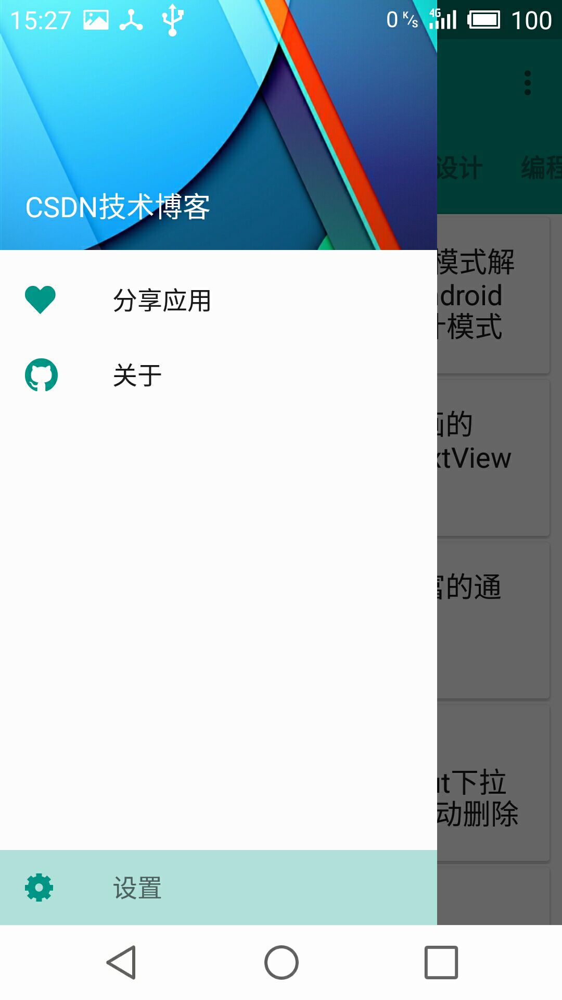
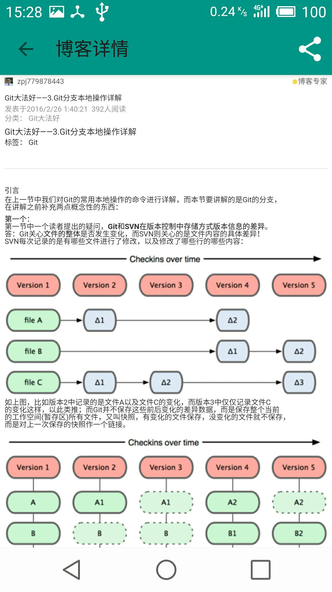

CSDN技术博客
========
业余时间开发的一个符合 Google Material Design 的CSDN技术博客
#ScreenShot

## 通过本项目可以了解
* 怎样使用不同的资源文件对不同版本的系统进行 **适配**
* 怎样使用 **ORMLite** 进行数据库存储
* 怎样符合 **MaterialDesign** 的设计规范
* 怎样使用 **support-v4** 以及 **appcompat** 兼容包
* 怎样使用最新的 **RecyclerView** , **ToolBar** 以及 **CardView**
* 怎样使用 **ViewPager** 以及 **fragment** 制作多页面滑动的效果
* 怎样通过制作自定义控件实现页面的 **滑动返回** 效果
* 怎样实现隐藏 ToolBar 以及其他的优美 **动效**
* 怎样通过 **DrawerLayout** 实现侧滑菜单的效果
* 怎样进行网络内容的**异步加载**以及数据缓存
* 怎样使用 **Gradle** 轻松完成项目的构建
* 怎样使用 **PreferenceFragment** 方便地完成设置界面
* 怎样使用 **属性动画**

##开发工具
* AndroidStudio
* Gradle

##项目中用到的开源库
* [Ultra Pull To Refresh](https://github.com/liaohuqiu/android-Ultra-Pull-To-Refresh) 下拉刷新组件
* [ORMLite](https://github.com/j256/ormlite-android) 好用的ORM（对象关系映射）框架
* [Android System Bar Tint](https://github.com/jgilfelt/SystemBarTint) 为Android4.4以上系统的状态栏和导航栏填充颜色
* [Android PagerSlidingTabStrip](https://github.com/jpardogo/PagerSlidingTabStrip) Material Desig 风格的ViewPager导航条

##关于作者
* nick - <nickdevp@gmail.com>

